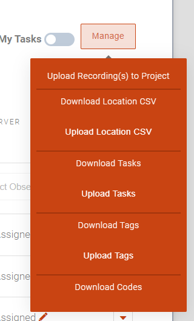
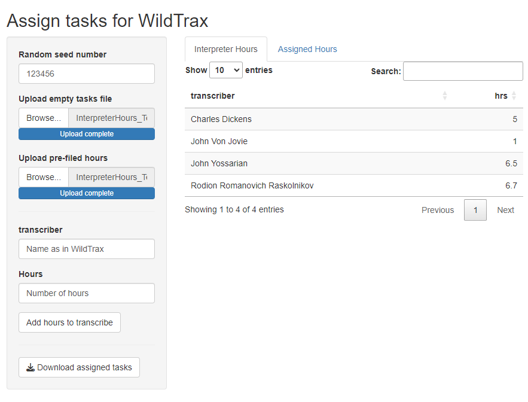
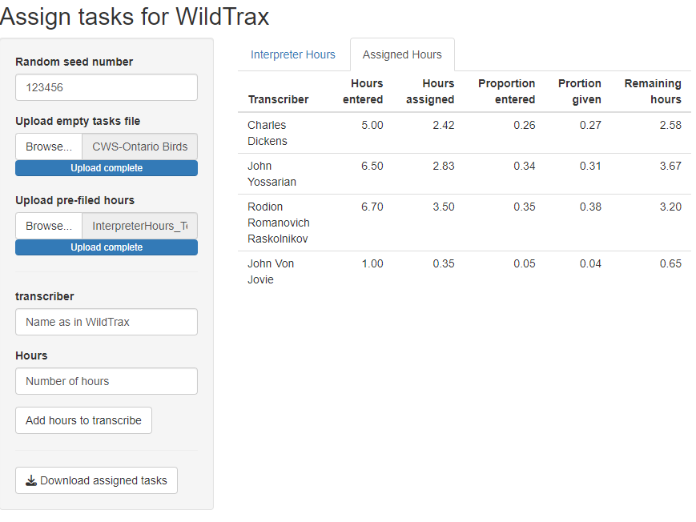

# Shiny_select

Shiny_select is a little shiny app to allow users of [WildTrax](www.wildtrax.ca) to assign tasks randomly using unequal effort. You can enter the data manually, but it is easier to use the [template](https://github.com/dhope/Shiny_select/blob/main/data/InterpreterHours_Template.csv).

## Usage

To run the app locally, you need to have shiny installed and then can run the following:

``` R
shiny::runGitHub("dhope/Shiny_select")
```

Transcriber names need to match what they are in the WildTrax system and effort is assigned in hours, but doesn't need to match total hours for a project, just be relatively correct.

To upload unassigned tasks download the tasks from the Wildtrax system directly and then just upload them into the program.

{width="223"}

On the application, you can either enter the hours and names manually or upload a csv template (attached here). The names have to match those in the Wildtrax system. Once entered or uploaded, you can edit a cell by double clicking on the cell.

 It should update the values in the Assigned Hours tab. Double check the "Hours entered" values match what you expect.



When you download the output it should match the input, with "\_assigned_tasks" appended.

*Note*: You don't need to upload the assigned hours every time if you are processing multiple projects. As long as the relative hours don't change, just upload the new tasks and it process these using the same assigned effort.
